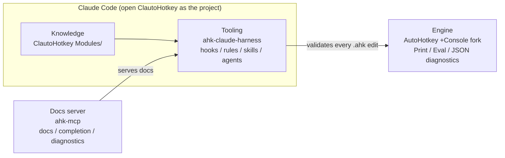

<div align="center">

  <h1>ClautoHotkey</h1>

  <p>
    <strong>An AI-native AutoHotkey v2 development system — a Claude Code harness, a console-enabled engine, structured knowledge modules, and an MCP docs server</strong>
  </p>

  <p>
    <a href="https://www.autohotkey.com/docs/v2/"></a>
    <a href="https://opensource.org/licenses/MIT"></a>
    <a href="https://github.com/TrueCrimeDev/ahk-mcp"></a>
  </p>

  <p>
    <a href="#the-system"></a>
    <a href="#the-harness"></a>
    <a href="#autohotkey-console-fork"></a>
    <a href="#modules"></a>
    <a href="#setup"></a>
  </p>

</div>

---

> [!IMPORTANT]
> This is only for AHK v2. No v1 support.

ClautoHotkey is an **AI-native AutoHotkey v2 development system**. Its centerpiece is
a **Claude Code harness** that validates every `.ahk` edit, auto-loads the right rules,
and routes work to AHK-specific skills and agents — backed by a console-enabled engine,
structured knowledge modules, and an MCP docs server.

---

<div align="center">
  <h2>The System</h2>
  <p><em>An AI-native AutoHotkey v2 development system — four parts that fit together.</em></p>
</div>



| Part | What it is |
|------|-----------|
| **Tooling** — the harness (this repo's `.claude/`) | Claude Code hooks, rules, skills, and agents that validate every `.ahk` edit and route AHK work. **The main feature.** |
| **Engine** — [AutoHotkey +Console fork](https://github.com/TrueCrimeDev/AutoHotkey) | Console-enabled AHK v2: real stdout, `Print`, `Eval`, JSON diagnostics, structured exit codes. |
| **Knowledge** — this repo's `Modules/` | The structured AHK v2 instruction set the AI reads (start with `Module_Instructions.md`). |
| **Docs server** — [ahk-mcp](https://github.com/TrueCrimeDev/ahk-mcp) | MCP server providing docs, code completion, and diagnostics. |

**New here?** Follow **[GETTING-STARTED.md](GETTING-STARTED.md)** for the zero-to-coding path.

---

<div align="center">
  <h2>The Harness</h2>
  <p><em>The main feature — a Claude Code environment that validates every edit, loads the right knowledge, and runs the tools.</em></p>
</div>

`.claude/` ships a full Claude Code harness: it auto-validates each `.ahk` edit,
auto-loads the relevant rule when you touch a matching file, and routes work to
AHK-specific skills and investigation agents. Turn it on after cloning:

```bash
cp harness.env.example harness.env   # set AHK_BIN_WIN to your AutoHotkey64.exe path
./setup.sh                            # renders settings.json, makes hooks executable
```

Then open this folder as the project in Claude Code. Set `AHK_DIAG_JSON=1` in
`harness.env` if you run the v2.1-alpha.30+Console fork (richer diagnostics); leave
`0` for stock AHK v2. Requires WSL or Git Bash and `jq`. The harness is also published
as a standalone template: [ahk-claude-harness](https://github.com/TrueCrimeDev/ahk-claude-harness).

### Skills

Invoke with `/<name>`:

| Skill | Use it for | Skill | Use it for |
|-------|-----------|-------|-----------|
| `/ahk-gui` | GUIs, controls, dark mode | `/ahk-convert` | Convert v1 → v2 |
| `/ahk-gui-gen` | Generate a GUI from a description | `/ahk-modernize` | Upgrade outdated v2 patterns |
| `/ahk-oop` | Classes, objects, Map, properties | `/ahk-new-class` | Scaffold a new class |
| `/ahk-text` | Strings, regex, escaping, parsing | `/ahk-docs` | Search the AHK v2 docs |
| `/ahk-fix` | Diagnose errors, debug, fix | `/ahk-ref` | Broad multi-domain reference |
| `/ahk-run` | Run headlessly, capture output | `/ahk-audit-errors` | Find silent failures / empty catches |
| `/ahk-eval` | Live REPL via the fork's `Eval()` | `/ahk-mistakes` | Recurring mistakes from the log |
| `/ahk-debug-dashboard` | Live debug state in a session | | |

### Agents

Fresh-context investigators — launched when a task needs its own window:

| Agent | Purpose |
|-------|---------|
| `ahk-analysis` | Code-quality, performance, and pattern analysis with recommendations |
| `ahk-context` | Project state, variable scope, and object-lifecycle tracking |
| `ahk-dependency-graph` | Parse `#Include` chains into a dependency map ("what breaks if I edit X?") |
| `ahk-profiler` | Instrument scripts with timing; report the slowest methods |
| `ahk-test-generator` | Generate Yunit-style test suites for a class or script |
| `ahk-com-explorer` | Introspect COM / WinAPI; generate typed wrappers and `DllCall` signatures |
| `ahk-uia-explorer` | Dump a window's UI Automation tree and generate interaction code |
| `ahk-orchestrator-v2` | Launch / stop / restart multiple scripts as one system |
| `layout` | GUI layout enforcement — overlap-free, mathematically positioned controls |

### Rules

Path-scoped notes in `.claude/rules/` that auto-load when you edit a matching file:
`ahk-v2-syntax` (any `.ahk`), `gui-work` (GUI files), `lib-development` (`Lib/`),
`main-script`, `test-scripts`, `demo-location`, `no-banner-comments`, `ahk-interpreter`,
and `ahk-fork-features` (the +Console fork).

### Hooks

Fire automatically across the Claude Code lifecycle:

| Event | Hook | What it does |
|-------|------|--------------|
| SessionStart | `ahk-session-primer` | Loads AHK context + the skill/agent routing table |
| UserPromptSubmit | `detect-v1-syntax` | Warns when your prompt contains AHK v1 syntax |
| PreToolUse · edit | `inject-rules` | Auto-loads the rule matching the edited file (once per session) |
| PreToolUse · Bash | `check-ahk-binary` | Blocks any AutoHotkey binary other than the configured one |
| PreToolUse · Bash | `check-git-account` | Opt-in guard against pushing as a blocklisted identity |
| PostToolUse · edit | `ahk-post-edit` | Syntax + runtime validation; **blocks** a broken edit |
| PostToolUse · edit | `ahk-auto-reload` | Restarts a running script after you edit it |
| PostToolUse | `error-logger` | Appends failures to `error-log.jsonl` (feeds `/ahk-mistakes`) |
| PreCompact | `post-compact-state` | Snapshots running scripts before context compaction |
| Stop / Notification | `session-event-logger` | Session-event logging |

(`check-ahk-connection` and `post-capture-guidance` add hints for the optional debug MCP; `_harness-env.sh` is the shared config loader every hook sources.)

### Commands

Slash commands in `.claude/commands/`:

| Command | What it does |
|---------|--------------|
| `/prime-ahk` | Prime AHK project context — recent work, running scripts, modified files, recent failures |
| `/spec-create` → `/spec-status` | Spec-driven workflow: `spec-create`, `spec-requirements`, `spec-design`, `spec-tasks`, `spec-execute`, `spec-list`, `spec-status` |

---

<div align="center">
  <h2>AutoHotkey Console Fork</h2>
  <p><em>The recommended interpreter — console-enabled AHK v2 for AI workflows.</em></p>
</div>

The harness is built around the **[AutoHotkey v2 +Console fork](https://github.com/TrueCrimeDev/AutoHotkey)**,
a console-enabled build that makes AHK far more AI-friendly:

- **Real stdout/stderr + `Print(fmt, vals*)`** — scripts emit output an AI reads directly, no GUI round-trip.
- **`Eval(expr)`** — runtime expression evaluator for REPL-style testing (the `/ahk-eval` skill).
- **JSON diagnostics** (`check /Diag=json`) — structured syntax errors the post-edit hook parses.
- **Structured crash logs + exit codes** — `/CrashLog`, exit `130` on Ctrl+C, and more.

Build it from source (branch `alpha`), point `AHK_BIN_WIN` at it, and set `AHK_DIAG_JSON=1`.
Stock AutoHotkey v2 also works — the harness falls back to `/validate` — but without `Print`/`Eval` or JSON diagnostics.

**Command-line modes**

| Mode | Command |
|------|---------|
| Standard run | `AutoHotkey64.exe script.ahk` |
| Debugger | `AutoHotkey64.exe /Debug script.ahk` |
| Headless error output | `AutoHotkey64.exe /ErrorStdOut script.ahk` |
| Hard headless | `AutoHotkey64.exe /Headless script.ahk` |
| JSON diagnostics | `AutoHotkey64.exe /Headless /Diag=json script.ahk` |
| Colored errors | `AutoHotkey64.exe /ErrorStdOut:color script.ahk` |
| Encoding override | `AutoHotkey64.exe /ErrorStdOut=UTF-8 script.ahk` |
| Check (syntax only) | `AutoHotkey64.exe check script.ahk` (or `/Check script.ahk`) |
| Test | `AutoHotkey64.exe test script.ahk` (or `/Test script.ahk`) |

---

<div align="center">
  <h2>Setup</h2>
</div>

```bash
git clone https://github.com/TrueCrimeDev/ClautoHotkey.git
```

| Requirement | For |
|-------------|-----|
| AutoHotkey v2 (the [+Console fork](https://github.com/TrueCrimeDev/AutoHotkey) recommended) | Running and validating scripts |
| [Claude Code](https://claude.com/claude-code) | The harness — hooks, skills, agents |
| WSL or Git Bash + `jq` | The harness hooks (written in bash) |
| Node.js | Optional — the [ahk-mcp](https://github.com/TrueCrimeDev/ahk-mcp) docs server |

Then follow **[GETTING-STARTED.md](GETTING-STARTED.md)** for the full zero-to-coding path.

---

<div align="center">
  <h2>Modules</h2>
  <p><em>The knowledge the AI reads. All modules live in <code>Modules/</code>. Start with <strong>Module_Instructions.md</strong>, then reference others by keyword.</em></p>
</div>

| Keyword | Module | Covers |
|---------|--------|--------|
| class, inheritance | `Module_Classes.md` | OOP, meta-functions, factory/observer patterns |
| object, HasProp | `Module_Objects.md` | Object hierarchy, descriptors, method binding |
| array, collection | `Module_Arrays.md` | 1-based indexing, functional patterns, sorting |
| gui, window, dialog | `Module_GUI.md` | GUI construction, ListView/TreeView, resize |
| error, try, catch | `Module_Errors.md` | Error hierarchy, diagnostics, custom exceptions |
| map, data, storage | `Module_DataStructures.md` | Array vs Map, nested structures, safe access |
| string, regex | `Module_TextProcessing.md` | String ops, regex, escapes, continuations |
| property, DefineProp | `Module_DynamicProperties.md` | Descriptors, closures, computed properties |
| prototype, ObjSetBase | `Module_ClassPrototyping.md` | Runtime class creation, decorators |
| escape, backtick | `Module_Escapes.md` | Quote/regex/path escaping rules |

Additional modules in `Modules/Supplemental/`.

---

<div align="center">
  <h2>Legacy</h2>
</div>

Pre-harness prompts and helper scripts live in [`legacy/`](legacy/) — the per-LLM
`System_Prompts/` (a shared `_Core.md` + per-model wrappers for pasting AHK v2 knowledge
into other models), `_Context_Creator.ahk`, the Ultimate Logger, the list editor, and the
clipboard tools. They predate the harness and aren't part of it; kept for reference.

---

<div align="center">
  <h2>Screenshots</h2>
</div>

<table>
  <tr>
    <td align="center"><strong>Ultimate Logger</strong></td>
    <td align="center"><strong>List Editor</strong></td>
  </tr>
  <tr>
    <td></td>
    <td></td>
  </tr>
</table>

---

<div align="center">
  <h2>Contributing</h2>
  <p>Contributions welcome. Also check out the <a href="https://github.com/TrueCrimeDev/ahk-mcp">AHK MCP Server</a>.</p>
</div>

---

<div align="center">
  <h2>Credits</h2>
  <p>
    <a href="https://www.autohotkey.com/docs/v2/">AHK v2 Docs</a> &bull;
    <a href="https://github.com/G33kDude">g.ahk</a> &bull;
    <a href="https://github.com/Descolada">Descolada</a> &bull;
    <a href="https://github.com/The-CoDingman">Panaku</a> &bull;
    <a href="https://github.com/0w0Demonic/AquaHotkey.git">0w0Demonic</a>
  </p>
</div>
