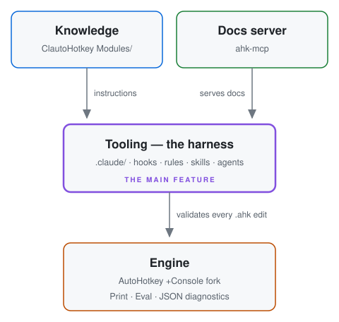

<div align="center">

  <h1>ClautoHotkey</h1>

  <p>
    <strong>An AI-native AutoHotkey v2 development system — a Claude Code harness, a console-enabled engine, structured knowledge modules, and an MCP docs server</strong>
  </p>

  <p>
    <a href="https://www.autohotkey.com/docs/v2/"></a>
    <a href="https://opensource.org/licenses/MIT"></a>
    <a href="https://github.com/TrueCrimeDev/ahk-mcp"></a>
  </p>

  <p>
    <a href="#the-system"></a>
    <a href="#the-harness"></a>
    <a href="#autohotkey-console-fork"></a>
    <a href="#modules"></a>
    <a href="#setup"></a>
  </p>

</div>

---

> [!IMPORTANT]
> This is only for AHK v2. No v1 support.

ClautoHotkey is an **AI-native AutoHotkey v2 development system**. Its centerpiece is
a **Claude Code harness** that validates every `.ahk` edit, auto-loads the right rules,
and routes work to AHK-specific skills and agents — backed by a console-enabled engine,
structured knowledge modules, and an MCP docs server.

---

<div align="center">
  <h2>Install</h2>
  <p><em>Two routes. The plugin is the one you want.</em></p>
</div>

### As a Claude Code plugin (recommended)

```
/plugin marketplace add TrueCrimeDev/ClautoHotkey
/plugin install clautohotkey@clautohotkey
```

That's it. The skills, agents, rules and validation hooks now apply to **your** AutoHotkey
scripts wherever they live — you don't clone anything into your project, and there's
nothing to configure. On first use the harness probes the standard AutoHotkey install
locations and uses what it finds.

Point it at a specific interpreter, or opt into the +Console fork's richer diagnostics, by
dropping a `harness.env` in your own project root:

```bash
AHK_BIN_WIN="C:\Program Files\AutoHotkey\v2\AutoHotkey64.exe"
AHK_DIAG_JSON=0     # 1 only on the +Console fork
```

Every key is optional — see [`harness.env.example`](harness.env.example) for the full set.

### As a cloned repo

If you'd rather have the files in your tree — to edit the knowledge modules, work offline,
or vendor a pinned copy:

```bash
git clone https://github.com/TrueCrimeDev/ClautoHotkey.git
cd ClautoHotkey && ./setup.sh
```

`setup.sh` writes a `harness.env` from the example, makes the hooks executable, and tells
you what to fill in.

**Requires** WSL or Git Bash, `jq`, and AutoHotkey v2. Python 3 for the module lint.

> [!NOTE]
> The knowledge modules were written and verified against the **v2.1-alpha.30 +Console
> fork**, so their examples use alpha and fork constructs freely. The `ahk-target` rule
> keeps generated code on the build *you* actually have — stock v2.0 by default, with a
> portable substitute documented for every gated construct.

---

<div align="center">
  <h2>The System</h2>
  <p><em>An AI-native AutoHotkey v2 development system — four parts that fit together.</em></p>
</div>

<div align="center">
  <picture>
    <source media="(prefers-color-scheme: dark)" srcset="Assets/system-diagram-dark.svg">
    
  </picture>
</div>

| Part | What it is |
|------|-----------|
| **Tooling** — the harness (`skills/`, `agents/`, `rules/`, `hooks/`) | Claude Code hooks, rules, skills, and agents that validate every `.ahk` edit and route AHK work. Ships as an installable plugin. **The main feature.** |
| **Engine** — [AutoHotkey +Console fork](https://github.com/TrueCrimeDev/AutoHotkey) | Console-enabled AHK v2: real stdout, `Print`, `Eval`, JSON diagnostics, structured exit codes. |
| **Knowledge** — this repo's `Modules/` | The structured AHK v2 instruction set the AI reads (start with `Module_Instructions.md`). |
| **Docs server** — [ahk-mcp](https://github.com/TrueCrimeDev/ahk-mcp) | MCP server providing docs, code completion, and diagnostics. |

**New here?** Follow **[GETTING-STARTED.md](GETTING-STARTED.md)** for the zero-to-coding path.

---

<div align="center">
  <h2>The Harness</h2>
  <p><em>The main feature — a Claude Code environment that validates every edit, loads the right knowledge, and runs the tools.</em></p>
</div>

The harness auto-validates each `.ahk` edit, auto-loads the relevant rule when you touch
a matching file, and routes work to AHK-specific skills and investigation agents. See
[Install](#install) — the plugin route needs no configuration.

It lives in four directories at the repo root, which is also the plugin layout:

| Directory | Contents |
|-----------|----------|
| `skills/` | 19 skills — 9 that load a knowledge module, 10 that drive the interpreter |
| `agents/` | 9 fresh-context investigators |
| `rules/` | 10 path-triggered rules, injected on first edit of a matching file |
| `hooks/` | 12 lifecycle hooks, wired by `hooks/hooks.json` |

A leaner, AHK-agnostic version of the same harness is published separately as
[ahk-claude-harness](https://github.com/TrueCrimeDev/ahk-claude-harness).

### Skills

Invoke with `/<name>`:

| Skill | Use it for | Skill | Use it for |
|-------|-----------|-------|-----------|
| `/ahk-gui` | GUIs, controls, dark mode | `/ahk-convert` | Convert v1 → v2 |
| `/ahk-gui-gen` | Generate a GUI from a description | `/ahk-modernize` | Upgrade outdated v2 patterns |
| `/ahk-oop` | Classes, objects, Map, properties | `/ahk-new-class` | Scaffold a new class |
| `/ahk-text` | Strings, regex, escaping, parsing | `/ahk-docs` | Search the AHK v2 docs |
| `/ahk-fix` | Diagnose errors, debug, fix | `/ahk-ref` | Broad multi-domain reference |
| `/ahk-run` | Run headlessly, capture output | `/ahk-audit-errors` | Find silent failures / empty catches |
| `/ahk-eval` | Live REPL via the fork's `repl` subcommand | `/ahk-mistakes` | Recurring mistakes from the log |
| `/ahk-com` | COM automation (Excel / WMI / events) | `/ahk-debug-dashboard` | Live debug state in a session |
| `/ahk-dllcall` | DllCall, Buffer, Struct, callbacks | `/ahk-winapi` | Messages, subclassing, DWM, WinRT |
| `/ahk-versions` | Version / portability, fork features | | |

### Agents

Fresh-context investigators — launched when a task needs its own window:

| Agent | Purpose |
|-------|---------|
| `ahk-analysis` | Code-quality, performance, and pattern analysis with recommendations |
| `ahk-context` | Project state, variable scope, and object-lifecycle tracking |
| `ahk-dependency-graph` | Parse `#Include` chains into a dependency map ("what breaks if I edit X?") |
| `ahk-uia-explorer` | Dump a window's UI Automation tree and generate interaction code |
| `ahk-orchestrator-v2` | Launch / stop / restart multiple scripts as one system |
| `ahk-profiler` | Instrument a script with timing and report the slowest methods |
| `ahk-test-generator` | Extract classes/methods and generate a test suite |
| `ahk-com-explorer` | Introspect a COM object's members; generate typed wrappers |
| `layout` | GUI layout enforcement — overlap-free mathematical positioning |

### Rules

Path-scoped notes in `rules/` that auto-load when you edit a matching file:
`ahk-v2-syntax` (any `.ahk`), `ahk-target` (keeps generated code on the build you have),
`gui-work` (GUI files), `lib-development` (`Lib/`), `main-script`, `test-scripts`,
`demo-location`, `no-banner-comments`, `ahk-interpreter`, and `ahk-fork-features`
(the +Console fork).

### Hooks

Fire automatically across the Claude Code lifecycle:

| Event | Hook | What it does |
|-------|------|--------------|
| SessionStart | `ahk-session-primer` | Loads AHK context + the skill/agent routing table |
| UserPromptSubmit | `detect-v1-syntax` | Warns when your prompt contains AHK v1 syntax |
| PreToolUse · edit | `inject-rules` | Auto-loads the rule matching the edited file (once per session) |
| PreToolUse · Bash | `check-ahk-binary` | Blocks any AutoHotkey binary other than the configured one |
| PreToolUse · Bash | `check-git-account` | Opt-in guard against pushing as a blocklisted identity |
| PostToolUse · edit | `ahk-post-edit` | Syntax + runtime validation; **blocks** a broken edit |
| PostToolUse · edit | `ahk-auto-reload` | Restarts a running script after you edit it |
| PostToolUse | `error-logger` | Appends failures to `error-log.jsonl` (feeds `/ahk-mistakes`) |
| PreCompact | `post-compact-state` | Snapshots running scripts before context compaction |
| Stop / Notification | `session-event-logger` | Session-event logging |

(`check-ahk-connection` and `post-capture-guidance` add hints for the optional debug MCP; `_harness-env.sh` is the shared config loader every hook sources.)

### Analysis Harness

The static-analysis core lives in `Lib/` and the tiered grading gates in
`Tools/harness/`. Everything runs on the interpreter itself — no external
toolchain.

| Piece | What it is |
|-------|------------|
| `Lib/TreeSitter.ahk` | Native binding to the holy-tao tree-sitter-autohotkey grammar (`Lib/tree-sitter-ahk.dll`, x64, kept next to it) |
| `Lib/Lint.ahk` | Structural lint — empty catches, v1-isms, shape problems |
| `Lib/CodeIntel.ahk` | Scope-aware semantics: symbol table, call graph, references, plus diagnostics (`unused-function`, `undefined-call`, `property-called-as-method`, opt-in `unknown-member`) with built-in member sets read off the running interpreter |
| `Tools/harness/GateStatic.ahk` | Tier-1 gate: fork `check` + `/validate` + Lint + CodeIntel, one NDJSON result per script |
| `Tools/harness/GateDryRun.ahk` + `DryRunShim.ahk` | Tier-3 gate: executes candidates with synthetic input, `Gui`, dialogs, and mutating file/registry I/O shimmed to record intent instead of firing |
| `Tools/harness/HarnessCore.ahk` | The shared NDJSON result emitter — the whole inter-tier contract |
| `Tools/harness/CheckResults.py` | Flags empty, timed-out and contradictory results before synthesis |
| `Tools/harness/CONTRACT.md` | The result schema every tier obeys |

```bash
AutoHotkey64.exe Tools/harness/GateStatic.ahk MyScript.ahk        # static gate
AutoHotkey64.exe Tools/harness/GateDryRun.ahk MyScript.ahk       # dry-run gate
```

Gates exit `0` when every script passes, `1` on failure, `2` on usage error.
A parse failure ends that script's branch — later checks record `"skipped"`,
never a silent zero. Details: `Tools/harness/CONTRACT.md`.

### Commands

Slash commands in `commands/`:

| Command | What it does |
|---------|--------------|
| `/prime-ahk` | Prime AHK project context — recent work, running scripts, modified files, recent failures |
| `/spec-create` → `/spec-status` | Spec-driven workflow: `spec-create`, `spec-requirements`, `spec-design`, `spec-tasks`, `spec-execute`, `spec-list`, `spec-status` |

---

<div align="center">
  <h2>AutoHotkey Console Fork</h2>
  <p><em>The recommended interpreter — console-enabled AHK v2 for AI workflows.</em></p>
</div>

The harness is built around the **[AutoHotkey v2 +Console fork](https://github.com/TrueCrimeDev/AutoHotkey)**,
a console-enabled build that makes AHK far more AI-friendly:

- **Real stdout/stderr + `Print(fmt, vals*)`** — scripts emit output an AI reads directly, no GUI round-trip.
- **`Eval(expr)`** — runtime expression evaluator; the fork's `repl` subcommand wraps it in a
  persistent stdin/stdout session, which is what the `/ahk-eval` skill drives.
- **JSON diagnostics** (`check /Diag=json`) — structured syntax errors the post-edit hook parses.
- **Structured crash logs + exit codes** — `/CrashLog`, exit `130` on Ctrl+C, and more.

Build it from source (branch `alpha`), point `AHK_BIN_WIN` at it, and set `AHK_DIAG_JSON=1`.
Stock AutoHotkey v2 also works — the harness falls back to `/validate` — but without `Print`/`Eval` or JSON diagnostics.

**Command-line modes**

| Mode | Command |
|------|---------|
| Standard run | `AutoHotkey64.exe script.ahk` |
| Debugger | `AutoHotkey64.exe /Debug script.ahk` |
| Headless error output | `AutoHotkey64.exe /ErrorStdOut script.ahk` |
| Hard headless | `AutoHotkey64.exe /Headless script.ahk` |
| JSON diagnostics | `AutoHotkey64.exe /Headless /Diag=json script.ahk` |
| Colored errors | `AutoHotkey64.exe /ErrorStdOut:color script.ahk` |
| Encoding override | `AutoHotkey64.exe /ErrorStdOut=UTF-8 script.ahk` |
| Check (syntax only) | `AutoHotkey64.exe check script.ahk` (or `/Check script.ahk`) |
| Test | `AutoHotkey64.exe test script.ahk` (or `/Test script.ahk`) |

---

<div align="center">
  <h2>Setup</h2>
</div>

```bash
git clone https://github.com/TrueCrimeDev/ClautoHotkey.git
```

| Requirement | For |
|-------------|-----|
| AutoHotkey v2 (the [+Console fork](https://github.com/TrueCrimeDev/AutoHotkey) recommended) | Running and validating scripts |
| [Claude Code](https://claude.com/claude-code) | The harness — hooks, skills, agents |
| WSL or Git Bash + `jq` | The harness hooks (written in bash) |
| Node.js | Optional — the [ahk-mcp](https://github.com/TrueCrimeDev/ahk-mcp) docs server |

Then follow **[GETTING-STARTED.md](GETTING-STARTED.md)** for the full zero-to-coding path.

---

<div align="center">
  <h2>Modules</h2>
  <p><em>The knowledge the AI reads. All modules live in <code>Modules/</code>. Start with <strong>Module_Instructions.md</strong>, then reference others by keyword.</em></p>
</div>

| Keyword | Module | Covers |
|---------|--------|--------|
| class, inheritance | `Module_Classes.md` | OOP, meta-functions, factory/observer patterns |
| object, HasProp | `Module_Objects.md` | Object hierarchy, descriptors, method binding |
| array, collection | `Module_Arrays.md` | 1-based indexing, functional patterns, sorting |
| gui, window, dialog | `Module_GUI.md` | GUI construction, ListView/TreeView, resize |
| error, try, catch | `Module_Errors.md` | Error hierarchy, diagnostics, custom exceptions |
| map, data, storage | `Module_DataStructures.md` | Array vs Map, nested structures, safe access |
| string, regex | `Module_TextProcessing.md` | String ops, regex, escapes, continuations |
| property, DefineProp | `Module_DynamicProperties.md` | Descriptors, closures, computed properties |
| prototype, ObjSetBase | `Module_ClassPrototyping.md` | Runtime class creation, decorators |
| escape, backtick | `Module_Escapes.md` | Quote/regex/path escaping rules |
| dllcall, buffer, struct | `Module_DllCall.md` | Native calls, marshalling, CallbackCreate |
| com, Excel, WMI | `Module_COM.md` | IDispatch automation, events, SafeArrays, ComCall |
| onmessage, subclass, WinRT | `Module_WinAPI.md` | Messages, subclassing, owner-draw, DWM, WinRT |
| version, fork, portable | `Module_Versions.md` | v2.0 / alpha / fork matrix + portable fallbacks |
| standards, syntax, keywords | `Module_Instructions.md` | Baseline standards and the keyword reference |

Additional modules in `Modules/Supplemental/`.

---

<div align="center">
  <h2>Showcase</h2>
  <p><em>GUIs built with this harness.</em></p>
  <h3>WinUI3 in AHK v2</h3>
</div>

**[WinUI3](https://github.com/TrueCrimeDev/WinUI3)** puts native WinUI3 controls in
AutoHotkey v2 via XAML Islands and direct WinRT interop. It was developed end-to-end
inside ClautoHotkey's harness: every edit validated on save against the +Console fork,
GUI work auto-routed through the `gui-work` rules and skills, and each window
screenshot-reviewed by the AI itself via `Tools/CaptureWindow.ahk`.

<table>
  <tr>
    <td align="center"><strong>Toolkit Showcase — DataTable</strong></td>
    <td align="center"><strong>Acrylic + Dark Mode Split</strong></td>
  </tr>
  <tr>
    <td></td>
    <td></td>
  </tr>
  <tr>
    <td align="center"><strong>SettingsCard</strong></td>
    <td align="center"><strong>TabbedCommandBar</strong></td>
  </tr>
  <tr>
    <td></td>
    <td></td>
  </tr>
</table>

<div align="center">
  <h3>Dark Mode Win32</h3>
  <p><em>Classic Win32 controls, fully dark-themed by <a href="https://github.com/TrueCrimeDev/DarkMode">DarkMode</a> a standalone library, not bundled here.</em></p>
</div>

<table>
  <tr>
    <td align="center"><strong>Modular Dark Mode System — Blue preset</strong></td>
    <td align="center"><strong>Pipeline Monitor</strong></td>
  </tr>
  <tr>
    <td></td>
    <td></td>
  </tr>
  <tr>
    <td align="center"><strong>DarkPropertyGrid</strong></td>
    <td align="center"><strong>DarkRichEdit</strong></td>
  </tr>
  <tr>
    <td></td>
    <td></td>
  </tr>
</table>

---

<div align="center">
  <h2>Contributing</h2>
  <p>Contributions welcome. Also check out the <a href="https://github.com/TrueCrimeDev/ahk-mcp">AHK MCP Server</a>.</p>
</div>

---

<div align="center">
  <h2>Credits</h2>
  <p>
    <a href="https://www.autohotkey.com/docs/v2/">AHK v2 Docs</a> &bull;
    <a href="https://github.com/G33kDude">g.ahk</a> &bull;
    <a href="https://github.com/Descolada">Descolada</a> &bull;
    <a href="https://github.com/The-CoDingman">Panaku</a> &bull;
    <a href="https://github.com/0w0Demonic/AquaHotkey.git">0w0Demonic</a>
  </p>
</div>
